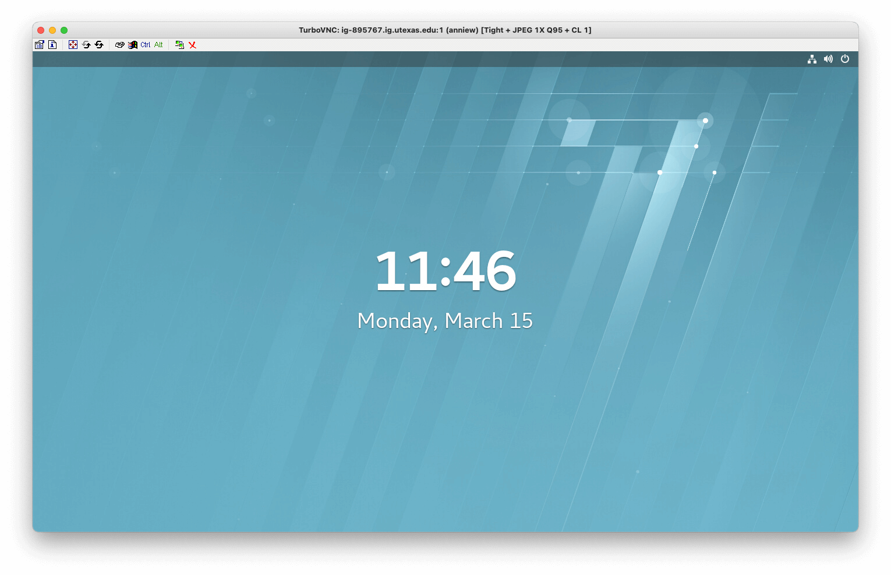
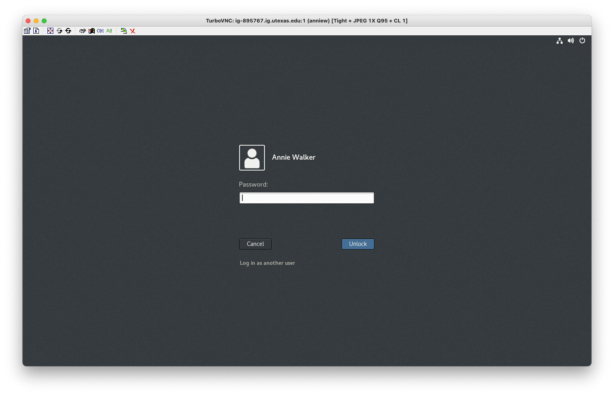

#### [ GBDS Landmark Update 2021 ]

# GBDS Landmark Update 2021

This repository contains instructions & supporting documents for `GBDS staff` to update their Linux user accounts to Landmark DSG 10ep4 and start using the new software.

Please skim this README file, and read through the `Guide-1` instructions before starting the update process.

### &#xFF0A;Update : Now available as an easy-to-use [wiki page](https://github.com/flsci/gbds-lm5-setup/wiki)

 

## Introduction

These documents are interactive, so links, images, and gifs are clickable. Some links navigate to items in the repository & some navigate to external websites.

* Use the links listed in the `CONTENTS` section below to navigate through the material;

* Click an image or gif to open the full-sized version in a new window or tab;

* You can view the manuals, but don’t download them from here — they’ll be available on our internal servers once the updates are finished.

#### CONTENTS

* [Part-1 : LM5 Setup](docs/guide1/setup-guide.md)
* [Part-2 : DSG Setup](docs/guide2/dsg-guide.md)
* [Manuals](manuals/)
* [Appendix](/chx-appendix.md)

## Environment

### Deployed

> 
> 
> 
 &#xFF0A; rhel 6 is being phased out, but is still available in limited capacity

### Deprecated

> #### Maintenance has expired for these applications, and UT ISO no longer supports them:
> 
> * DecisionSpace 10ep.0.05
> * OpenWorks 5000.10.2.0
> * Red Hat Enterprise Linux v6 (in-progress)

### RH7 Lockscreen vs Login Page

> #### Hit `enter` from the lockscreen to show the login fields:

<table style="width:100%">
<tr>
  <td></td>
  <td></td>
</tr>
<tr>
  <td><b>rh7 Lockscreen</b></td>
  <td><b>rh7 Login page</b></td>
</tr>
</table>

 

## Abbreviations + Shorthand

<table style="width:100%">
  <tr>
    <td><b>10ep.x.xx</b></td>
    <td>DecisionSpace version number</td>
  </tr>
  <tr>
    <td><b>10ep</b></td>
    <td>the version being deprecated (10ep.0.05) i.e. "Landmark4" , "lm4"</td>
  </tr>
  <tr>
    <td><b>10ep4</b></td>
    <td>the version being deployed (10ep.4.03) i.e. "Landmark5" , "lm5"</td></td>
   </tr>
     <tr>
    <td><b>DSG</b></td>
    <td>DecisionSpace Geoscience i.e. DecisionSpace (at some point Landmark added "Geoscience" to the name)</td>
  </tr>
  <tr>
    <td><b>lm4, lm5</b></td>
    <td>Landmark4 & Landmark5 &#x2192; UTIG's internal naming convention for the deprecated & new versions, respectively</td>
  </tr>
  <tr>
    <td><b>RHEL, rhel, rh</b></td>
    <td>Red Hat Enterprise Linux</td>
  </tr>
</table>

 

## License

Content created by the [project owner](https://github.com/flsci) uses the Creative Commons Attribution-NonCommercial-ShareAlike 4.0 International license. A copy of the license is available in the repository's [LICENSE](/LICENSE) file.

## Made With

<table>
<tr>
<td><b>badges</b> &#x2023;&#x00A0;<a href="https://forthebadge.com/">For the Badge</a> &#x2023;&#x00A0;<a href="https://shields.io/">Shields IO</a> &#x2023;&#x00A0;<a href="https://simpleicons.org/">Simple Icons</a></td>
<td><b>images</b> &#x2023;&#x00A0;<a href="https://www.ffmpeg.org/">ffmpeg</a> &#x2023;&#x00A0;<a href="https://imagemagick.org/index.php">ImageMagick</a> &#x2023;&#x00A0;<a href="https://tinypng.com/">TinyPNG</a></td>
<td><b>text</b> &#x2023;&#x00A0;<a href="https://graphemica.com/">Graphemica</a> &#x2023;&#x00A0;<a href="https://macdown.uranusjr.com/">MacDown</a> &#x2023;&#x00A0;<a href="https://www.sublimetext.com/">SublimeText</a></td>
</tr>
</table>

## Contact

**Annie Walker**
 
GBDS Research Associate  &nbsp;&vert;&nbsp; <walkerae@ig.utexas.edu> &nbsp;&vert;&nbsp; [github @flsci](https://github.com/flsci)
