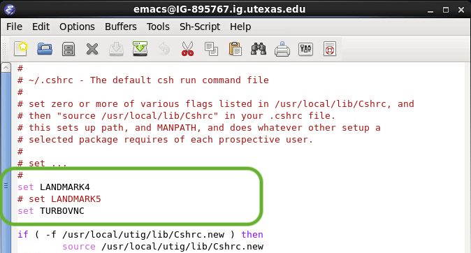

#### [ GBDS Landmark Update 2021 ] [ Guide 1 ]


# Setup Landmark 5

> These instructions outline `Part-1` in the process for `GBDS staff` to update their Linux user accounts to Landmark DSG 10ep4 and start using the new software.


> &#x2217;&#x2217;&#x2217; Don't do `Part-1` alone.<br>
> &emsp; &#x2192; To avoid data-loss, all GBDS users need to complete this step at the same time.

<br>

## &#x2B1C;&#x00A0; step-1 : Set lm5

> #### Connect to the VPN and authenticate using Cisco AnyConnect & the DUO app.

### 1.1&#x00A0; Log into a Linux workstation

### 1.2&#x00A0; Open your `Home` folder

### 1.3&#x00A0; Set file browser to show hidden files : `press ctrl H`

<blockquote>
<table style="width:100%">
<tr>
  <td></td>
  <td></td>
</tr>
<tr>
  <td><b>Figure 1:&#x00A0; (a)&#x00A0; Before <code>ctrl-H</code></b></td>
  <td><b>(b)&#x00A0; After <code>ctrl-H</code></b></td>
</tr>
</table>
</blockquote>

<br>

### 1.4&#x00A0; Open `.cshrc` with a text-editor (gedit, emacs, etc)

&emsp; &#x2192; Right-click the file & "Open with..."

<blockquote>

|  |
|-----------------------------------------------------------|
| Figure 2: Location of `.cshrc` run-command file           |
</blockquote>

<br>

### 1.5&#x00A0; Edit `.cshrc` as follows:

> * change <code>&#x2003; set LANDMARK4</code> to <code># set LANDMARK4</code>
> * change <code># set LANDMARK5</code> to <code>&#x2003; set LANDMARK5</code>

<blockquote>
<table style="width:100%">
<tr>
  <td></td>
  <td></td>
</tr>
<tr>
  <td><b>Figure 3:&#x00A0; (a)&#x00A0; With <code>LANDMARK4</code>set</b></td>
  <td><b>(b)&#x00A0; With <code>LANDMARK5</code>set</b></td>
</tr>
</table>
</blockquote>

<br>

### 1.6&#x00A0; `ctrl H` again to re-hide hidden files

<br>

## &#x2B1C;&#x00A0; step-2 : Set VNC

### 2.1&#x00A0; Open terminal / command prompt

> * Do this from your home computer, not from a remote desktop


### 2.2&#x00A0; Connect to the UTIG remote server using `ssh`:
 
```bash
ssh <your-user-name>@ig-<computer-name>.ig.utexas.edu
```
<br>

### 2.3&#x00A0; Enter your unix account password (not eid pw)

> * FYI - The password field stays blank when you type
> * Press `Enter` when done
> * (sometimes takes 20–30 sec to process after password-entry)

<br>

### 2.4&#x00A0; List your acitve `vncserver` sessions:

```bash
vncserver -list
```

```bash
# EXAMPLE OUTPUT #

TurboVNC sessions:

X DISPLAY #  PROCESS ID
:1           16000
:2           4079
```
<br>

### 2.5&#x00A0; Kill acitve `vncserver` sessions:

> * Repeat as needed to kill all sessions
> * Use the display number(s) from step-4 &nbsp;&#x2192;&nbsp; including the `:`


```bash
vncserver -kill :<display-number>

```

<br>

### 2.6&#x00A0; Close UTIG server connection : `press ctrl d`

```bash
# EXAMPLE OUTPUT #

ig-123456.ig.utexas.edu 363% logout
Connection to ig-123456.ig.utexas.edu closed.
➜  ~
```
<br>

> ### [video] Watch steps 2.1–2.6

<details>
<summary><b>click to open</b></summary>


</details>

<br>


### 2.7&#x00A0; Open new terminal window & Connect to UTIG server:

```bash
ssh <your-user-name>@ig-<computer-name>.ig.utexas.edu

<enter password>
```

<br>

### 2.8&#x00A0; Start the VNC server:

```bash
vncserver

```

<br>

### 2.9&#x00A0; Close UTIG server connection : `press ctrl d`

> * Then type `exit` to close terminal
> * (or just quit the application)

<br>

> ### [video] Watch steps 2.7–2.9

<details>
<summary><b>click to open</b></summary>


</details>

<!--
<details>
<summary><b>see video</b></summary>

<video width="70%" controls loop>
<source src="./img/ch1/step2/set-vnc-2-start.mov">
</video>
</details>
-->

<br>
