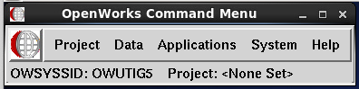
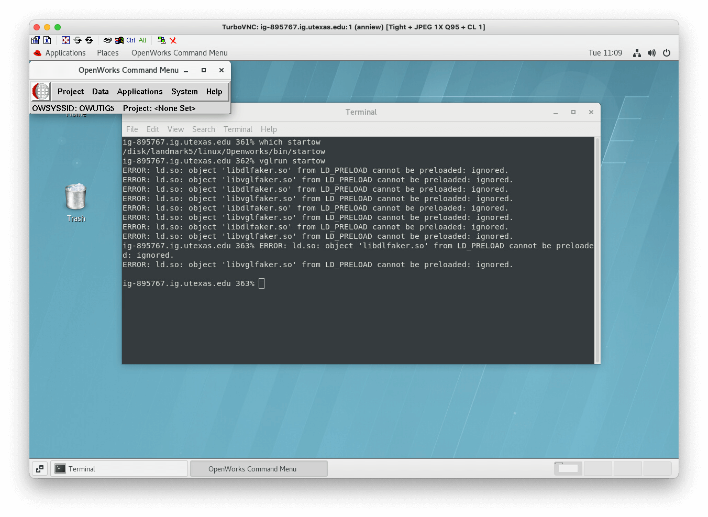
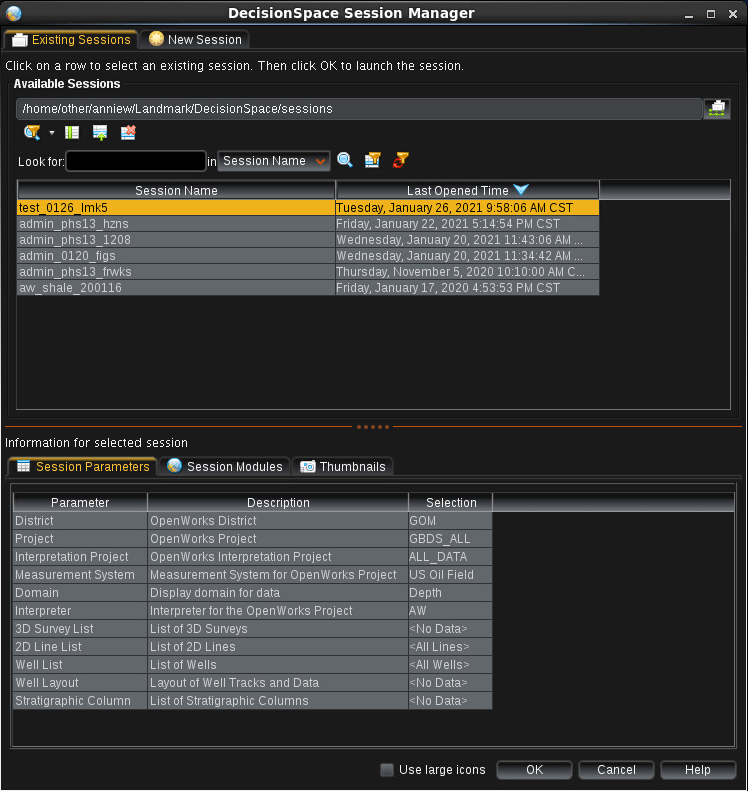
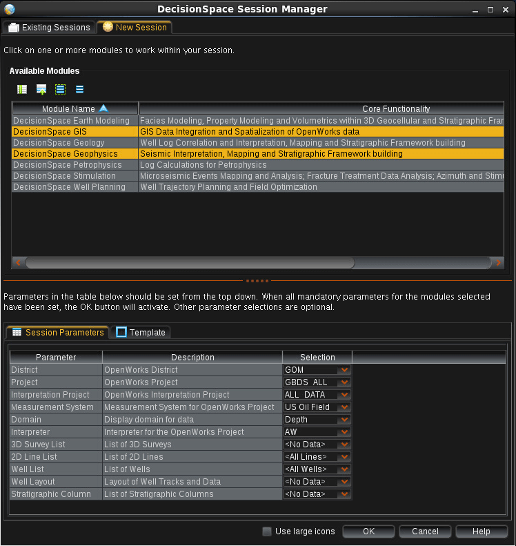
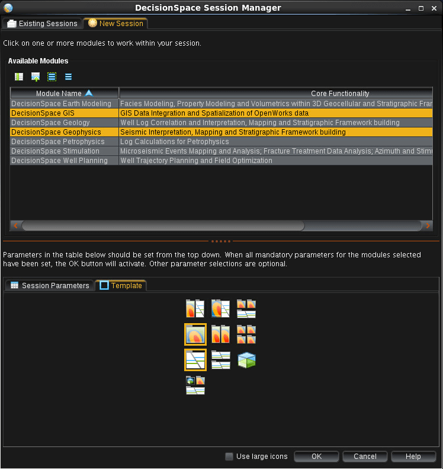
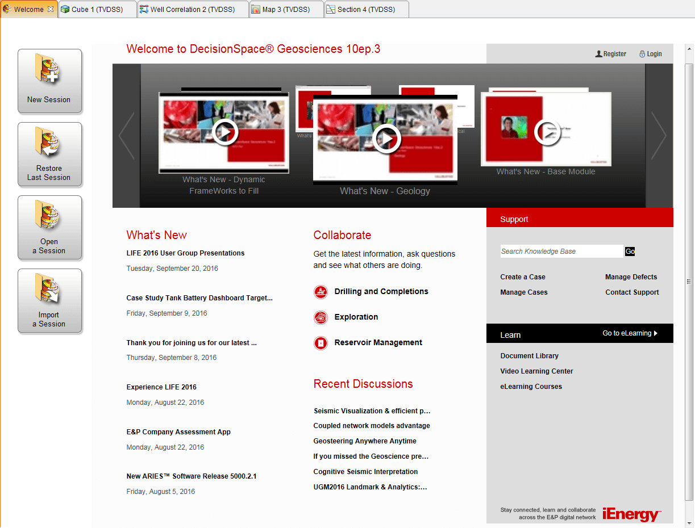
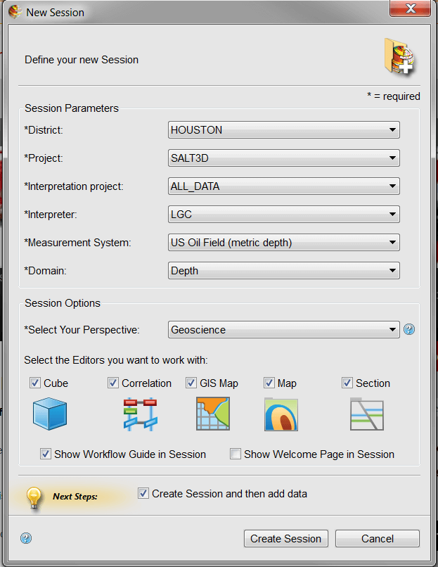
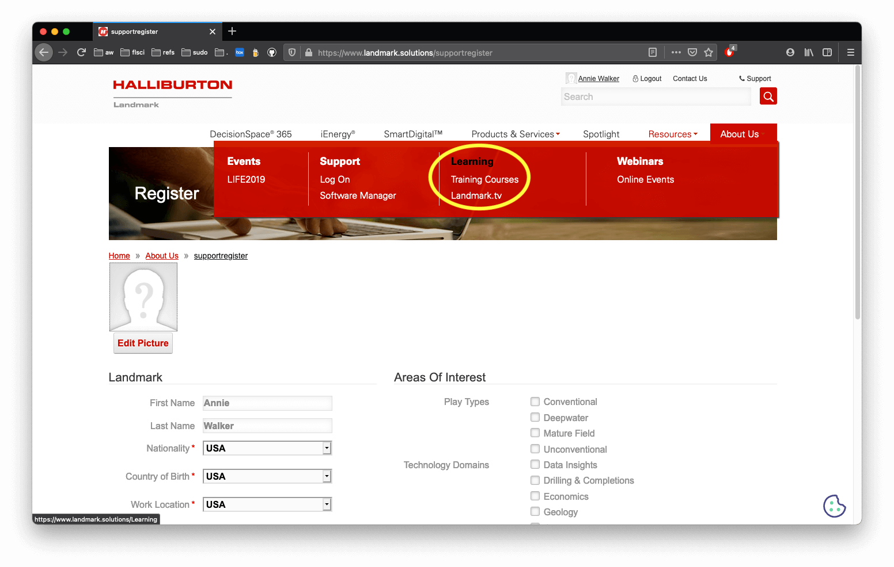
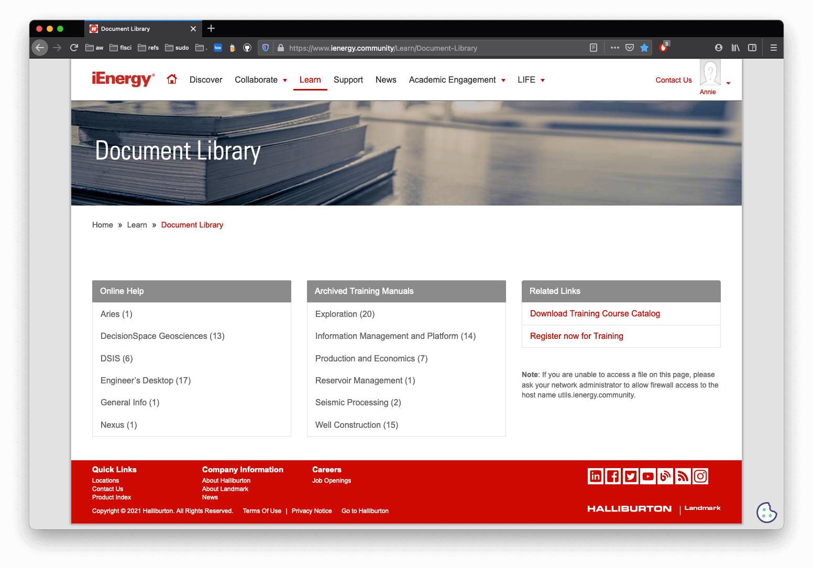

#### [ GBDS Landmark Update 2021 ] [ Part-2 ]

# Setup DecisionSpace

> These instructions outline `Part-2` in the process for `GBDS staff` to update their Linux user accounts to Landmark DSG 10ep4 and start using the new software.

<br>

## &#x2B1C;&#x00A0; step-1 : Verify lm5

### 1.1 &#x00A0; Use command : `which startow`

> * Output should show `/disk/landmark5/linux/ ...etc`

```bash
# EXAMPLE OUTPUT #

ig-895767.ig.utexas.edu 361% which startow
/disk/landmark5/linux/Openworks/bin/startow
ig-895767.ig.utexas.edu 362% 
```
<br>

### 1.2 &#x00A0; Open terminal + Start OpenWorks:

```bash
vglrun startow
```
<br>

<table style="width:100%">
<tr>
  <td></td>
  <td><h3>Make sure the OW Command Menu shows <code>OWUTIG5</code></h3></td>
</tr>
</table>



<br>

## &#x2B1C;&#x00A0; step-2 : DecisionSapce Startup Page

### Old DecisionSpace

> #### Existing + New Sessions

<table style="width:100%">
<tr>
  <td></td>
  <td></td>
</tr>
<tr>
  <td><b>Figure 1:&#x00A0; (a)&#x00A0; Existing Sessions tab</b></td>
  <td><b>(b)&#x00A0; New Session tab</b></td>
</tr>
</table>

<br>

> #### Session Parameters + Templates

<table style="width:100%">
<tr>
  <td></td>
  <td></td>
</tr>
<tr>
  <td><b>Figure 2:&#x00A0; (a)&#x00A0; Session Parameters tab</b></td>
  <td><b>(b)&#x00A0; Templates tab</b></td>
</tr>
</table>

<br>

### New DecisionSpace

<table style="width:100%">
<tr>
  <td></td>
  <td></td>
</tr>
<tr>
  <td><b>Figure 3:&#x00A0; (a)&#x00A0; Startup page</b></td>
  <td><b>(b)&#x00A0; New Session setup</b></td>
</tr>
</table>

<br>

## &#x2B1C;&#x00A0; step-3 : Optional Landmark Account

### 3.1 To use the new DecisionSpace Learning tools, register for a Landmark User Account : [here](https://identity.halliburton.com/CustomSelfReg/register.jsp?xHalTemp=ienergy)

### 3.2 Sign-in to an existing Landmark User Account : [here](https://www.landmark.solutions/)<br /><sub> &#x2192; see top-right of page for <code>Sign In</code></sub>

### 3.3 Select `Resources` > `Learning`<br /><sub> &#x2192; the `About Us` tab is always red; the dropdown shown here is from the Resources tab</sub>

> 

<br>

### 3.4 Scroll to bottom of `Learning` page to find link for `Documents Library`<br /><sub> &#x2192; or go use [this link](https://www.landmark.solutions/Resources/Learning/Document-Library) to go directly</sub>

> 

