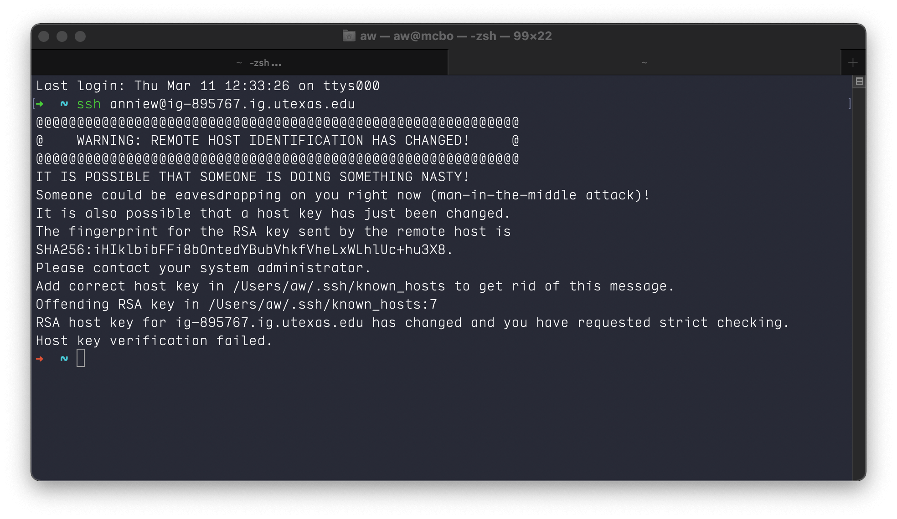
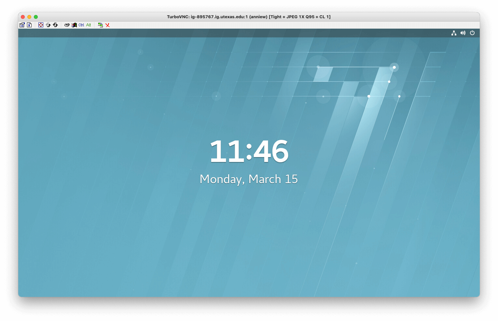
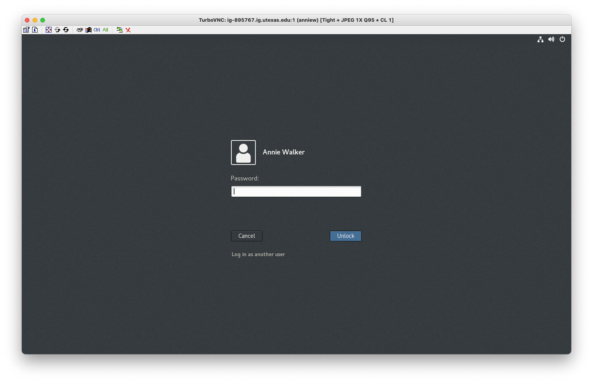

#### [ GBDS Landmark Update 2021 ] [ Appendix ]


# Appendix

> This information is a supplement to the instructions for `GBDS staff` to update their Linux user accounts to Landmark DSG 10ep4 and start using the new software.

#### CONTENTS

* [Linux rh7 Info](#linux-rh7-info)
  * [Remote Host ID Changed](#remote-host-id-changed)
  * [Lockscreen vs Login Page](#lockscreen-vs-login-page)

<br>

# Linux rh7 Info


## Remote Host ID Changed


> ### You may get this error the 1st time you try to connect to your remote computer after it gets updated to rh7:



### 1. To fix, run `ssh-keygen` in your shell:

> * Use with the `-R` option to remove all keys for a given host from the local `known_hosts` file
> * A new key will auto-generate next time you connect via `ssh`

```bash
ssh-keygen -R <ig-<host-name>.ig.utexas.edu
```

### 2. Then connect to your remote host using `ssh`:

```bash
ssh <user-name>@ig-<host-name>.ig.utexas.edu
```

### 3. Type `yes` when asked if host should be trusted, then `enter`

### 4. Enter your account password (not eid pw)

> * FYI - The password field stays blank when you type
> * Press `enter` when done
> * (sometimes takes 20–30 sec to process after password-entry)

<br>


## Lockscreen vs Login Page

> #### Hit `enter` from the lockscreen to show the login fields:

<table style="width:100%">
<tr>
  <td></td>
  <td></td>
</tr>
<tr>
  <td><b>rh7 Lockscreen</b></td>
  <td><b>rh7 Login page</b></td>
</tr>
</table>

<br>


