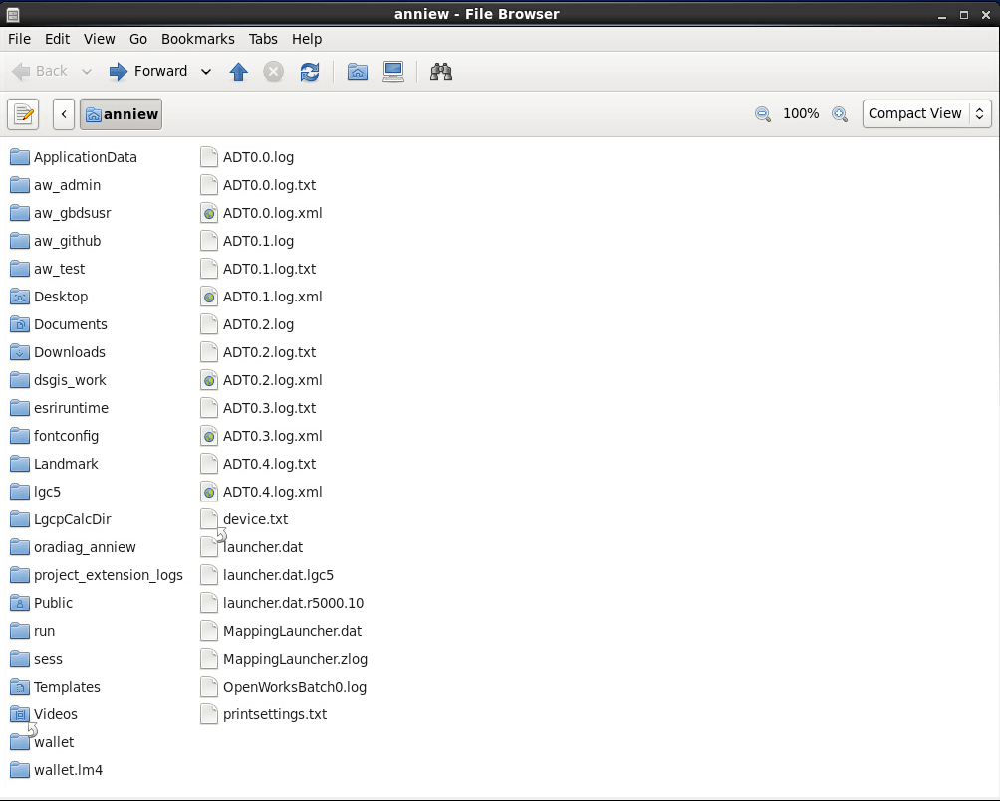
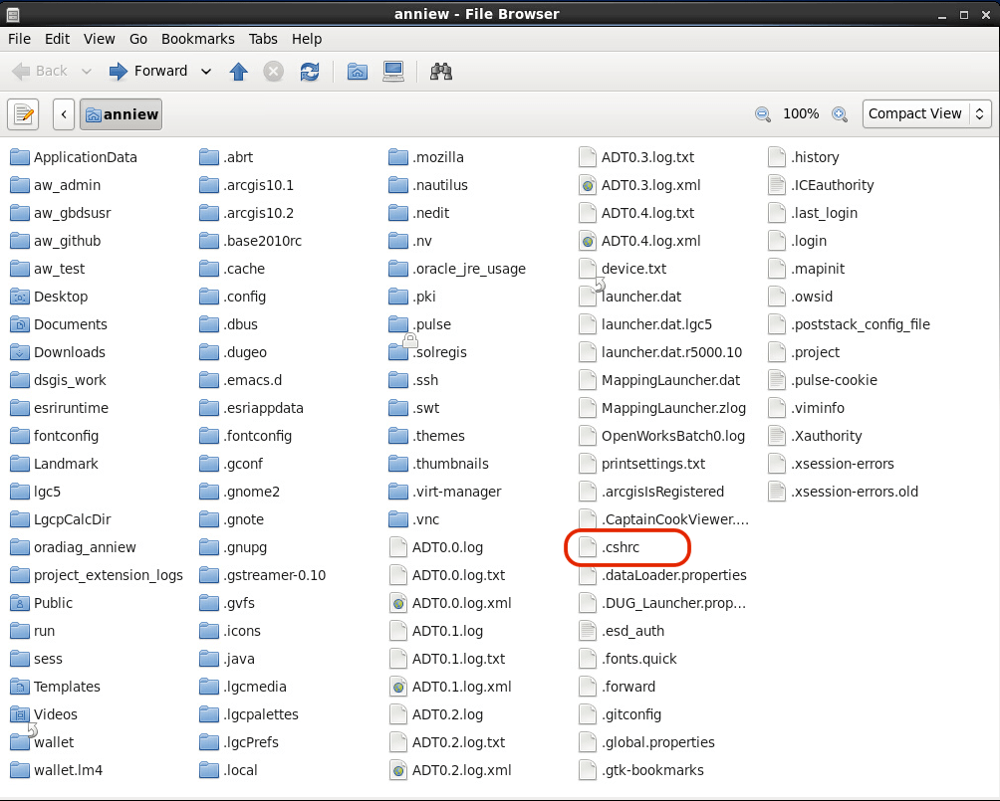
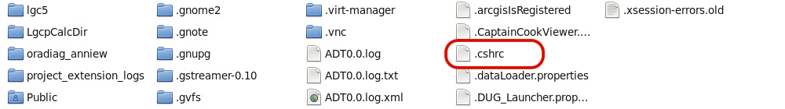
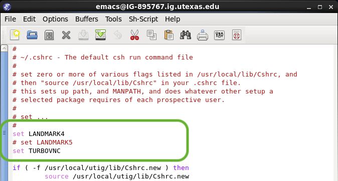

#### [ GBDS Landmark Update 2021 ] [ Guide-1 : Setup LM5 ]

## step-1:&#x00A0; Set LM5 in your `.cshrc` file

> ### Reminder:
> &#x2217;&#x2217;&#x2217; Don't do `Step-1` alone 
> &emsp;&#x2192; To avoid data-loss, all GBDS users need to complete this step at the same time

### 1.0&#x00A0; Connect to the VPN and authenticate using Cisco AnyConnect & the DUO app

### 1.1&#x00A0; Log into a Linux workstation

### 1.2&#x00A0; Open your `Home` folder

### 1.3&#x00A0; Set file browser to show hidden files : `press ctrl h`

<table style="width:100%">
<tr>
  <td></td>
  <td></td>
</tr>
<tr>
  <td><b>Figure 1:&#x00A0; (a)&#x00A0; Before <code>ctrl-h</code></b></td>
  <td><b>(b)&#x00A0; After <code>ctrl-h</code></b></td>
</tr>
</table>

 

### 1.4&#x00A0; RIght-click `.cshrc` & open with a text-editor (gedit, emacs, etc)

<table style="width:100%">
<tr>
  <td></td>
</tr>
<tr>
  <td><b>Figure 2: Location of <code>.cshrc</code> run-command file</b></td>
</tr>
</table>

 

### 1.5&#x00A0; Edit `.cshrc` as follows:

> * change <code>&#x2003; set LANDMARK4</code> to <code># set LANDMARK4</code>
> * change <code># set LANDMARK5</code> to <code>&#x2003; set LANDMARK5</code>

<table style="width:100%">
<tr>
  <td></td>
  <td></td>
</tr>
<tr>
  <td><b>Figure 3:&#x00A0; (a)&#x00A0; With <code>LANDMARK4</code>set</b></td>
  <td><b>(b)&#x00A0; With <code>LANDMARK5</code>set</b></td>
</tr>
</table>

 

### 1.6&#x00A0; `ctrl h` again to re-hide hidden files

### 1.7&#x00A0; Quit TurboVNC or other VNC viewer

### &#x21B3; Start Step-2 : [Reset VNC](/step2-set-vnc.md)

 
