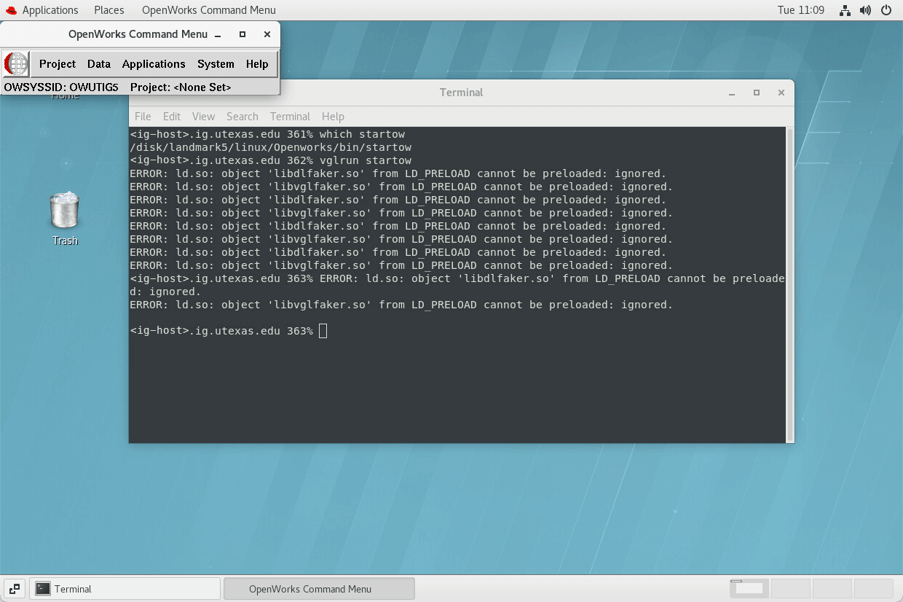
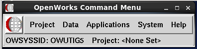

#### [ GBDS Landmark Update 2021 ] [ Guide-1 : Setup LM5 ]


## step-3:&#x00A0; Verify LM5

### 3.0&#x00A0; Log into your remote Linux computer using TurboVNC (or other VNC viewer)

### 3.1&#x00A0; Open terminal

> * (right-click Linux desktop)

### 3.2&#x00A0; Use command : `which startow`

> * The output should look like this : `/disk/landmark5/linux/ ...etc`

```bash
# EXAMPLE OUTPUT #

ig-895767.ig.utexas.edu 361% which startow
/disk/landmark5/linux/Openworks/bin/startow
ig-895767.ig.utexas.edu 362%

```

### 3.2&#x00A0; Start OpenWorks:

```bash
vglrun startow

```



<table style="width:100%">
<tr>
  <td></td>
  <td><h3>Make sure the OW Command Menu shows <code>OWUTIG5</code></h3></td>
</tr>
</table>

<hr>

### &#x21B3; Start Part-2 : [DSG Guide](../guide2/dsg-guide.md)

<br>
