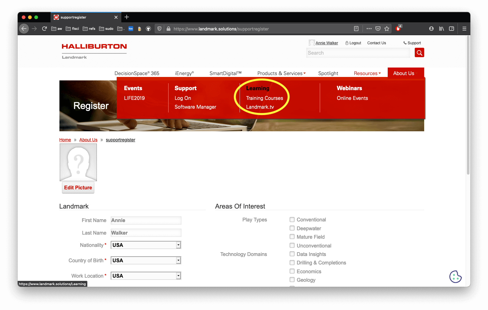
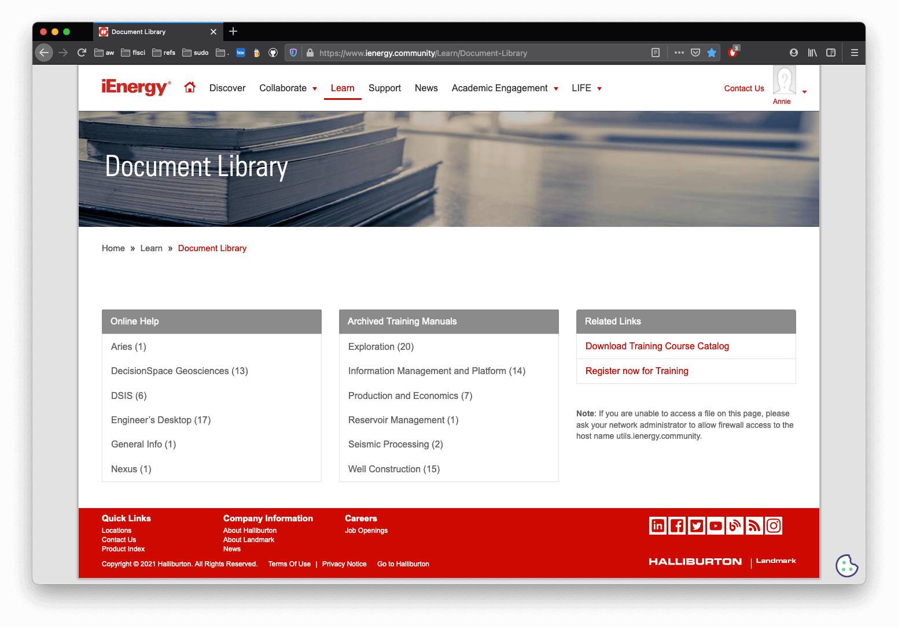

#### [ GBDS Landmark Update 2021 ] [ Guide 2 : DSG ep4 ]

## Optional Landmark Account

### Register for a free Landmark User Account to use the new DecisionSpace Learning tools

<blockquote>
<table>
<tr>
  <td><b>Sign-up for a new account</b></td>
  <td><b><a href="https://identity.halliburton.com/CustomSelfReg/register.jsp?xHalTemp=ienergy">Registration page</a></b></td>
</tr>
<tr>
  <td><b>Sign-in to existing account</b></td>
  <td><b><a href="https://www.landmark.solutions/Login?returnurl=%2f">Login page</a></b></td>
</tr>
</table>
</blockquote>

 

### Find the Learning tools after loggin in

> * Login takes you to your account profile
> * Select `Resources` &#x2192; `Learning`
> * Note: the `About Us` tab is always red -- the dropdown shown here is actually from the Resources tab

### Find the Documents Library

> * Scroll to bottom of the `Learning` page to find link for `Documents Library`
> * &#x2192; or go directly with this link : [/Document-Library](https://www.landmark.solutions/Resources/Learning/Document-Library)

[ Return to : [DSG Guide](/dsg-guide.md) ]

