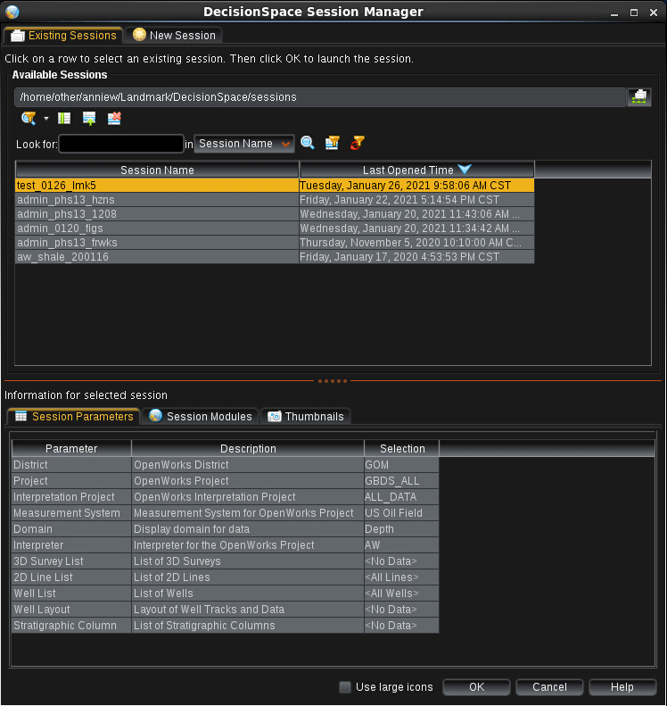
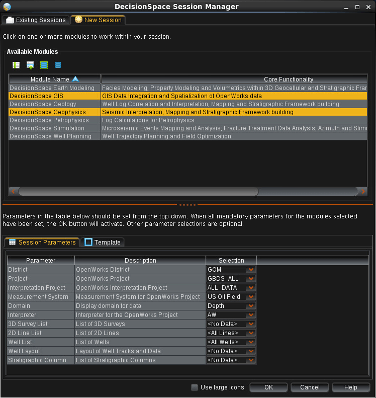
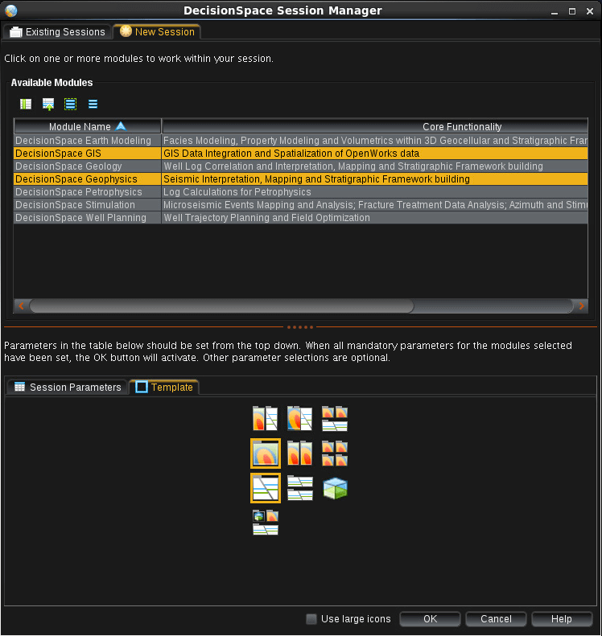
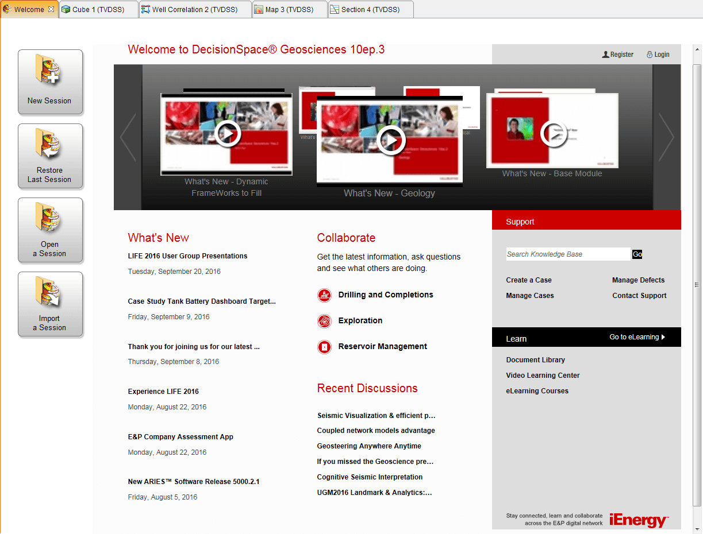
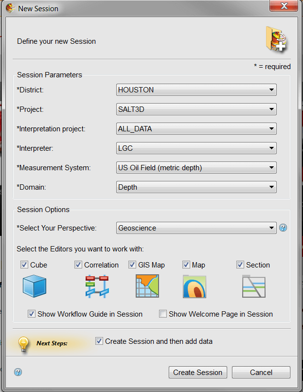

#### [ GBDS Landmark Update 2021 ] [ Guide 2 : DSG ep4 ]

## DecisionSapce Startup Windows

### LM4 Startup Window

> ### Upper Pane : Existing + New Sessions

<table style="width:100%">
<tr>
  <td></td>
  <td></td>
</tr>
<tr>
  <td><b>Figure 1:&#x00A0; (a)&#x00A0; Existing Sessions tab</b></td>
  <td><b>(b)&#x00A0; New Session tab</b></td>
</tr>
</table>

> ### Lower Pane : Session Parameters + Templates

<table style="width:100%">
<tr>
  <td></td>
  <td></td>
</tr>
<tr>
  <td><b>Figure 2:&#x00A0; (a)&#x00A0; Session Parameters tab</b></td>
  <td><b>(b)&#x00A0; Templates tab</b></td>
</tr>
</table>

 

### LM5 Startup Windows

> * Single window
> * Tabs replaced by (4) buttons on left side of window (Fig. 3a)
> * New Sessions parameters condensed to (1) popup that appears after clicking `New Session` button (Fig. 3b)

<table style="width:100%">
<tr>
  <td></td>
  <td></td>
</tr>
<tr>
  <td><b>Figure 3:&#x00A0; (a)&#x00A0; Startup page</b></td>
  <td><b>(b)&#x00A0; New Session setup</b></td>
</tr>
</table>

[ Return to : [DSG Guide](/dsg-guide.md) ]

### &#x21B3; Next : [Import Existing Sessions](/import-lm4-sessions.md)

